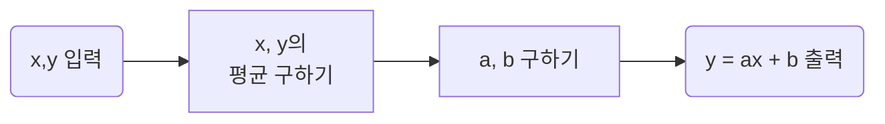

# 최소 제곱법 (Method of least squares)

>입력 변수 $$$(x)$$$가 한 개일 때 사용합니다. (여러 개의 입력을 처리하지 못한다.)
>여러개의 $$$(x, y)$$$가 주어질때, $$$y = ax + b$$$를 구하는 방법입니다.

 
- $$$ a = \frac{\sum (x - \bar{x})(y - \bar{y})}{\sum(x - \bar{x})^{2}} $$$
- $$$b = \bar{y} - (\bar{x} \times a )$$$

## Ex) 01_Least_Square_Method.py

|공부한 시간|2시간|4시간|6시간|8시간
|:--:|:--:|:--:|:--:|:--:|:--:|
|성적|81점|93점|91점|97점|

- $$$x, y$$$ 추출하기

>$$$ x = \{ 2, 4, 6, 8 \}$$$
>$$$ y = \{ 81, 93, 91, 97 \}$$$

&nbsp;
- $$$\bar{x}, \bar{y}$$$ 구하기

>$$$ \bar{x} = \frac{2 + 4 + 6 + 8}{4} = 5 $$$
>$$$ \bar{y} = \frac{81 + 93 + 91 + 97}{4} = 90.5 $$$

&nbsp;
- $$$a, b$$$ 구하기

>$$$a = \frac{\sum (x - \bar{x})(y - \bar{y})}{\sum(x - \bar{x})^{2}}$$$
>$$$ = \frac{(2 - 5)(81 - 90.5) + (4 - 5)(93 - 90.5) + \cdots + (8 - 5)(97 - 90.5)}{(2 - 5)^{2} + (4 - 5)^{2} + \cdots + (8 - 5)^{2}  } $$$
>$$$ = \frac{46}{20} = 2.3$$$
>&nbsp;
>$$$ b = \bar{y} - (\bar{x} \times a ) $$$
>$$$ = 90.5 - (2.3 \times 5 ) $$$
>$$$ = 79 $$$

&nbsp;
- $$$y = ax + b$$$ 출력

>$$$y = 2.3x + 79 $$$

|공부한 시간|2시간|4시간|6시간|8시간
|:--|:--|:--|:--|:--
|성적|81점|93점|91점|97점|
|예측 값|83.6|88.2|92.8|97.4
