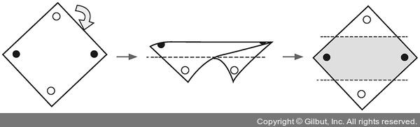
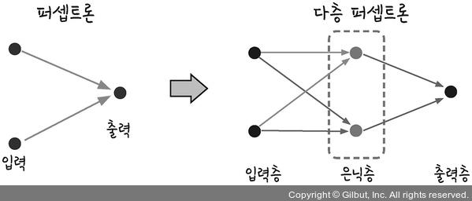
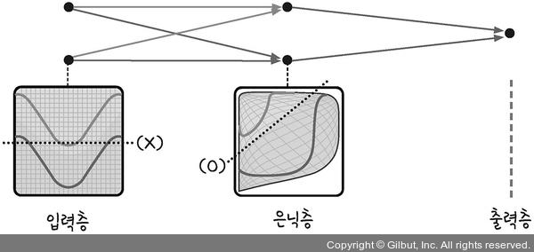
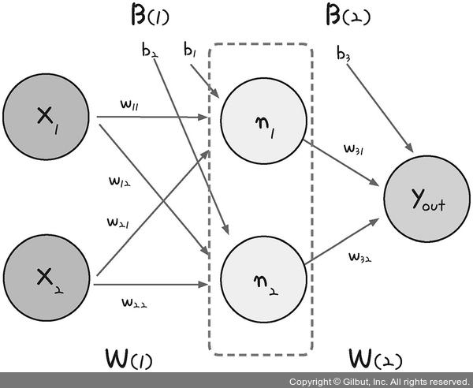
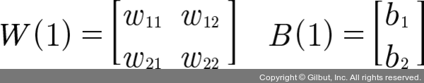
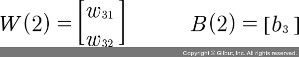
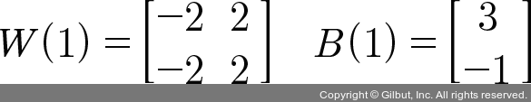
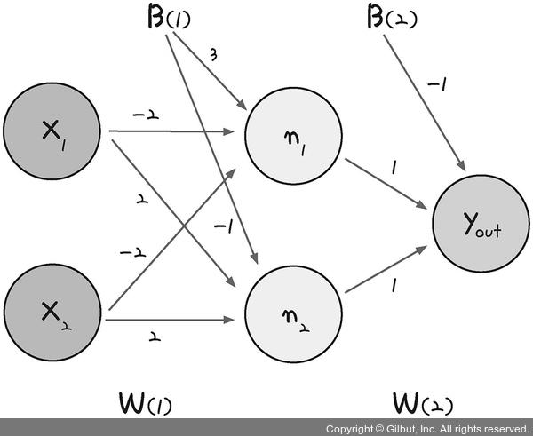

# 다층 퍼셉트론 (Multi Layer Perceptron)
----

 

> 혹시 성냥개비로 정삼각형 네개를 만들어낼 수 있으신가요?  
> 아마도 대부분 이 문제를 **2차원 평면상**에서만 해결하려고 할거에요  
> 방금 우리가 고민했던 XOR 문제의 정답은 이 단순해보이는 퀴즈에서 부터 시작됩니다.

 
 
 
 

 

> 정답은 바로 이렇게 **입체적인 정사면체**를 만들어 해결하는 것입니다.  
> 이제 우리가 어떻게 문제를 해결해야 할지 얼추 느낌이 오시나요?

 
 
 
 

 

> 자, 이렇게 그림처럼 우리는 좌표 평면 자체를 일그러뜨려 우릭 원하는 결과를 도출 시킬 수 있어요.  
> 이 과정을 수행하기 위해서는 두개의 퍼셉트론을 한꺼번에 계산할 수 있어야 해요 :(

 
 
 
 

 

> 일반적인 퍼셉트론과는 달리 다층 퍼셉트론에게는 중간에 한 층 더 추가된 모습이 보이네요!  
> 이게바로 **은닉층(hidden layer)** 이라고 불리우는, 입력과 출력 사이에 추가적인 레이어랍니다 :)

 
 
 
 

 

> 이렇게 은닉층이 추가된 모델은 그림처럼 전체 평면이 일그러져 우리가 원하는 분류를  
> 보다 쉽게 해결하는 모습을 보여준답니다!

 
 
 
 

다층 퍼셉트론의 설계
------

 

> 입력층과 출력층 사이에 숨어있는 은닉층을 만드는 것을 도식화한 모습입니다.  
> 가운데 숨어있는 은닉층으르로 퍼셉트론이 각각 자신의 **가중치(w)** 와 **바이어스(b)** 값을 보내고  
> 은닉층에서 모인 값을 다시 한 번 더 **시그모이드 함수**를 통하여 최종값으로 결과를 보냅니다.  
> 이렇게 은닉층에 모이는 중간 정거장을 **노드(node)** 라고 하고  
> 여기서는 n1, n2,로 표현했네요!

 
 
 
 

<strong>  

n1 = σ(x1 * w11 + x2 * w21 + b1)
  

 

n2 = σ(x1 * w12 + x2 * w22 + b2) 
  

</strong>  

 
 

> n1과 n2의 값은 각각 단일 퍼셉트론의 값과 같으며, 위 두식의 결과값이 출력층으로 전달이 될 겁니다.  
> 출력층 역시 시그모이드 함수를 통해 y값이 정해지며, 이값을 **y_out**이라고 할 때  
> 우리는 식을 다음과 같이 표현할 거에요!

 

<strong>

y_out= σ(n1 * w31 + n2 * w32 + b3) 

</strong>

 
 

> 이제 각각의 **가중치(w)** 와 **바이어스(b)** 의 값을 정할 차례입니다. 2차원 배열로 늘어놓으면 다음과 같이  
> 표시할수 있어요. 은닉층을 포함해 6개의 가중치, 3개의 바이어스가 필요하네요 ;)

> 이제 우리는 문제를 해결할 준비가 다 된것 같군요!

 
 
 
 

#XOR문제의 해결
----

 

> 우리는 이제 어떤 가중치와 바이어스가 필요한 지를 알아보았기 때문에 예시로 앞서 배웠던 형식에 맞게  
> 값을 주고 XOR문제를 해결해 볼 거에요 :)

 
 
 
 

> 이렇게 6개의 가중치와 3개의 바이어스에 값을 할당한 형식을 도식에 대입해 보도록 하죠.

 
 
 
 

 

> 짠! 이렇게 보기 간편한 도식이 나타났네요!  
> 이제 보기 좋게 만들어진 도식으로 우리가 원하는 값으로 나오는 지 점검해볼게요

 
 
 
 

|x1|x2|n1|n2|y_out|우리가 원하는 값
|:---:|:---:|:---:|:---:|:---:|:---:
|0|0|σ(0 * (-2) + 0 * (-2) + 3) ≈ 1|σ(0 * 2 + 0 * 2 - 1) ≈ 0|σ(1 * 2 + 0 * 1 - 1) ≈ 0|0
|0|1|σ(0 * (-2) + 1 * (-2) + 3) ≈ 1|σ(0 * 2 + 1 * 2 - 1) ≈ 1|σ(1 * 2 + 1 * 1 - 1) ≈ 1|1
|1|0|σ(1 * (-2) + 0 * (-2) + 3) ≈ 1|σ(1 * 2 + 0 * 2 - 1) ≈ 1|σ(1 * 2 + 1 * 1 - 1) ≈ 1|1
|1|1|σ(1 * (-2) + 1 * (-2) + 3) ≈ 0|σ(1 * 2 + 1 * 2 - 1) ≈ 1|σ(0 * 2 + 1 * 1 - 1) ≈ 0|0

 

> 한 층마다 도출되는 결과를 확인하면서   
> 이렇게 우리가 원하는 결과를 다중 퍼셉트론을 통해 해결할 수 있었어요!   
> 어때요, 꽤 할만하죠? ;)

# 코딩으로 XOR 문제 해결하기
-----

<pre>
<code>
import numpy as np
 
# 가중치와 바이어스
w11 = np.array([-2,-2])
w12 = np.array([2,2])
w2 = np.array([1,1])

# 편향(bias)의 값 할당
b1 = 3
b2 = -1
b3 = -1

# 다층 퍼셉트론 함수 정의
def MLP(x, w, b):
    # 레이어 결과값을 numpy의 sum함수를 통하여 계산
    y = np.sum(w * x) + b
    if y <= 0:
        return 0
    else:
        return 1

# 은닉층 연산에 대한 함수

# NAND 게이트 
def NAND(x1, x2):
    # 첫번째 노드의 결과값을 반환
    return MLP(np.array([x1, x2]), w11, b1)

# OR 게이트
def OR(x1, x2):
    # 두번째 노드의 결과값을 반환
    return MLP(np.array([x1, x2]), w12,b2)

# AND 게이트
def AND(x1, x2):
    return MLP(np.array([x1, x2]), w2,b3)

# XOR 게이트
def XOR(x1, x2):
    return AND(NAND(x1, x2), OR(x1, x2))

if __name__ == '__main__':
    for x in [(0,0), (1,0), (0,1), (1,1)]:
        y = XOR(x[0], x[1])
        print("입력 값: " + str(x) + "출력 값" + str(y))

</code>
</pre>

