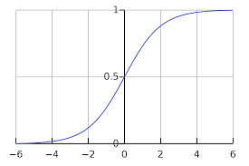

#퍼셉트론 (Perceptron)
-----

이렇게 보면 좀... 징그럽기도 하고...?

 

> 사람의 뇌는 치밀하게 연결된 약 1000억 개의 뉴런으로  이루어져있습니다. 뉴런 간에는 시냅스라 
> 불리우는 화학물질이 나와 전위 변화를 일으키며 전위가 임계값을 넘을 경우, 다음 뉴런으로 신호를 
> 전달하고 임계값이 도달하지 못할 경우엔 아무것도 하지 않아요.
--------------

> 이 메커니즘은 우리가 앞서 배운 로지스틱 회귀, 활성화 함수에 의해 일정 수준을 넘으면 참,
>  그렇지 않으면 거짓을 보내는 개념과 같음을 알수있죠:)
-----------

 

>  사실 이를 기반으로 시작된 연구가 바로 인공 신경망입니다! 뉴런과 뉴런간의 연결과 같이 퍼셉트론이라 불리우는 입력값과 활성화 함수를 사용해 출력값을 다음으로 넘기는 가장 작은 신경망의 단위를 통해 
> 우리는 멋진 인공 신경망을 만들겁니다!

-----

