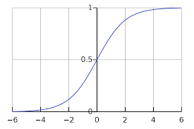
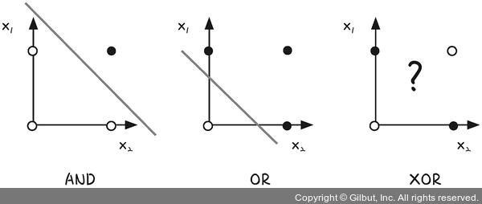

#퍼셉트론 (Perceptron)
-----

 

> 사람의 뇌는 치밀하게 연결된 약 1000억 개의 뉴런으로  이루어져있습니다. 뉴런 간에는 시냅스라  
> 불리우는 화학물질이 나와 전위 변화를 일으키며 전위가 임계값을 넘을 경우, 다음 뉴런으로 신호를  
> 전달하고 임계값이 도달하지 못할 경우엔 아무것도 하지 않아요.

 
 
 
 

> 이 메커니즘은 우리가 앞서 배운 로지스틱 회귀, 활성화 함수에 의해 일정 수준을 넘으면 참,
>  그렇지 않으면 거짓을 보내는 개념과 같음을 알수있죠 :)

 
 
 
 

 

> 이를 기반으로 시작된 연구가 바로 **인공 신경망**입니다! 우리는 뉴런과 뉴런간의 연결과 같이 **퍼셉트론**이라 
> 불리우는 가장 작은 신경망의 단위를 통해 입력 및 시그모이드 함수 같은 활성화 함수와 함께 
> 출력값을 다음으로 넘기는 멋진 인공 신경망을 만들겁니다!

 
 

# 가중치, 가중합, 바이어스, 활성화 함수
---------

 

> 지난번에 배웠던 용어를 다시한번 짚고 넘어가 보도록 하죠. 앞서 설명했던  
> **y = a * x + b** 
> 이 식에서 각각의 변수들이 무엇을 의미했었나요?

* **x**는 **독립변수**로 입력값에 해당합니다.
* **y**는 **종속변수**로 x의 값에 따라가는 녀석에요.
* **a**는 **기울기**라고도 했지만 이번에는  **가중치(w)** 라는 이름으로 다시 정의를 할게요.
* **b**도 마찬가지로 **절편**이라고 불렀지만 이번에는 **편향** 혹은 **바이어스(bias)** 라고 부를게요

 

> 이렇게 다시 딥러닝스럽게 단장을 한 식은  
> **y = w * x + b**
> 이렇게 쓰인답니다:)
>
> 이런 식의 결과값은 **가중합**이라고 부를거에요. 그리고 우리가 아까 뉴런의 전위값이니 뭐니하면서
> 했던 것 처럼 가중합을 두고 **1** 혹은 **0**을 출력해서 다음으로 보낼지 말지를 결정할 필요가 있어요
> 
> 이때 쓰이는 것이 바로 **활성화 함수(activation function)** 랍니다! 
> 이 활성화 함수에는 우리가 저번시간에 배웠던 시그모이드 함수가 대표적인 활성화 함수에요 ;)

 
 

# XOR문제
-------

> 일반적으로 우리는 **선형회귀**와 **로지스틱 선형 회귀**를 통해 선이나 2차원 면을 그리는 작업에 대해 
> 익혔습니다. 하지만 불가피하게도 그림의 **XOR**과 같이 제 아무리 여러개의 선을 긋더라도 두 점사이를 깔끔하게 구분지을 수 없는 상황이 있어요

 * **XOR(exclusive OR)** 은 논리 회로에 등장하는 개념으로 컴퓨터는 0과 1을 입력해 하나의 값을 출력하는   
 회로가 모여 만들어지는데, 이 회로를 게이트라고 합니다.

 

- **AND 진리표**
  
|x1|x2|결과값
|:---:|:---:|:---:|
|0|0|0|
|0|1|0|
|1|0|0|
|1|1|1|, 

- **OR 진리표**

|x1|x2|결과값
|:---:|:---:|:---:|
|0|0|0|
|0|1|1|
|1|0|1|
|1|1|1|

- **XOR 진리표**

|x1|x2|결과값
|:---:|:---:|:---:|
|0|0|0|
|0|1|1|
|1|0|1|
|1|1|0|

- **NAND 진리표**

|x1|x2|결과값
|:---:|:---:|:---:|
|0|0|1|
|0|1|1|
|1|0|1|
|1|1|0|