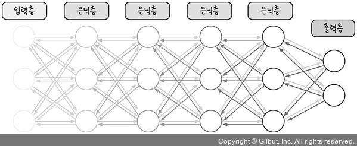

# 역전파의 문제점
----

 

> 이렇게 우리는 역전를 통해서 가중치와 바이어스를 정하지 않고도 온전한 값을 도출 하는 방법에 대해 익혀보았습니다.  
> 하지만 이럼에도 불구하고 문제가 되는게 하나 남아있죠

 
 
 
 

 

> 이는 오차 역전파가 가중치를 수정하는 과정에서, 미분을 통한 기울기의 값이 점점 더 작아지며  
> 최종적으로 가장 처음 층까지 온전히 도달하지 못하는 것으로
> 이는 **기울기의 소실** 이라고 합니다 :(  
>   
> 아래 그림이 기울기의 소실을 도식화한 모습입니다

 
 
 
 

> 이러한 문제는 사실 활성화 함수에서 비롯된 것으로 시그모이드 함수를 미분할 경우, 최대치가 0.3 입니다. 1보다 작으니 계속 곱하다 보면 0에 가까워 지겠죠?  
>   
> 따라서 기울기가 사라지다 보니 가중치를 수정하기 어려워진다는 것이죠  
>  
>  신경망을 연구하는 학자들은 이를 해결하고자 시그모이드가 아닌 다른 함수로 대체하기 시작했죠

 
 
 
 

 

> 자! 이렇게 시그모이드가 아닌 여러 함수가 있습니다. 각각 살펴보도록 하죠!

1. 하이퍼볼릭 탄젠트 함수 (tanh)
   * 함수의 범위를 -1에서 1로 확장한 형태이지만 여전히 1보다 작은 값이 존재하므로 기울기 소실의 문제는 남아있는 상태입니다
2. 렐루 함수 (ReLU)
   * 0보다 작을땐 모든값을 0으로 처리하고 0보다 큰 값은 그대로 사용하는 방식의 함수입니다.
   * 미분값이 0보다 크기만 해도 값이 1이 되기 때문에 여러 은닉층을 거치더라도 기울기 소실에 대해 큰 문제가 되지않죠 :)
3. 소프트플러스 함수 (softplus)
   * 렐루 함수에서 0이 되는 순간을 완화한 함수이며 개발중에 있습니다.

 
 
 
 

# 고급 경사 하강법
---

> 우리는 가중치를 업데이트하는 경사하강법에 대해 익혔습니다.  
> 경사하강법은 가중치를 정확하게 찾아가지만 전체 데이터를 미분해야 하기 때문에 계산량이 매우 많다는 단점을 갖고 있죠.  
>  
> 따라서 이를 개선시킨 고급 경사하강에 대해 알아보는 시간을 가져 보도록 하겠습니다.

* 확률적 경사 하강법
  * 전체 데이터가 아닌 랜덤하게 추출한 일부데이터를 사용합니다
  * 진폭이 상대적으로 불안정한 모습을 나타냅니다
  * 속도가 빠르면서 최적 해에 근사한 값을 찾아냅니다

* 모멘텀
  * 경사 하강법과 같이 기울기를 구한다.
  * 하지만 오차 수정전 앞의 수정 값과 방향을 참고하여 같은 방향으로 수정되도록 유도
  * 이전 이동값을 고려하여 일정 비율만큼 다음 값을 결정

|고급 경사하강법|개요|효과|케라스 사용법|
|:---:|:---:|:---:|:---:|:---:|
|확률적 경사하강법|0|σ(0 * (-2) + 0 * (-2) + 3) ≈ 1|σ(0 * 2 + 0 * 2 - 1) ≈ 0|σ(1 * 2 + 0 * 1 - 1) ≈ 0|0
|모멘텀|1|σ(0 * (-2) + 1 * (-2) + 3) ≈ 1|σ(0 * 2 + 1 * 2 - 1) ≈ 1|σ(1 * 2 + 1 * 1 - 1) ≈ 1|1
|네스테로프 모멘텀|0|σ(1 * (-2) + 0 * (-2) + 3) ≈ 1|σ(1 * 2 + 0 * 2 - 1) ≈ 1|σ(1 * 2 + 1 * 1 - 1) ≈ 1|1
|알엠에스프롭|1|σ(1 * (-2) + 1 * (-2) + 3) ≈ 0|σ(1 * 2 + 1 * 2 - 1) ≈ 1|σ(0 * 2 + 1 * 1 - 1) ≈ 0|0
|아담|1|σ(1 * (-2) + 1 * (-2) + 3) ≈ 0|σ(1 * 2 + 1 * 2 - 1) ≈ 1|σ(0 * 2 + 1 * 1 - 1) ≈ 0|0 