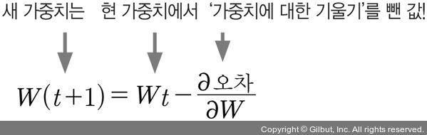

# 오차 역전파(back propagation)
----

 

> 우리는 이제 **입력 값과 출력값을 알고 있는 상태**에서 문제를 해결하는 것에 대해 익혔습니다  
> 하지만, 실제 프로젝트를 수행하는 과정에서 가중치와 바이어스는 누가 정해주지 않을 겁니다  
> 묘하게 머리가 아파지는 기분이죠? 걱정마세요, 우리들은 이미 정답을 알고 있으니까요 ;)  
>   
> 바로 **경사 하강법**을 그대로 이용하는 방법입니다!

 
 
 
 

 

> 임의의 가중치를 선언 하고 결과값을 이용해 오차를 구한 뒤 이 오차가 최소인 지점으로 계속해서  
> 조금씩 이동시킵니다.  이 오차가 최소가 되는 점을 찾는 것
> 이것이 우리가 알고자 하는 답이랍니다
> 앞서 3주차 수업때 익힌 **로지스틱 회귀**와 **선형회귀**의 개념을 기억해내신다면 이는 충분히 이해할 수 있을거에요

 
 
 
 

 

> 우리가 배운 **경사하강법**은 **입력과 출력이 하나**일 때, 즉 **단일 퍼셉트론**일 경우 였습니다  
> 그런데 이번에는 **은닉층**이라는 개념이 추가 되었기 때문에 계산이 조금더 복잡하게 변해 버렸죠  
> 하지만 기본적인 원리는 크게 다르지 않으니 걱정 마세요 :)  

1. 임의의 초기 가중치를 준 뒤, 결과를 계산한다.
2. 계산 결과와 우리가 원하는 값 사이의 오차를 구한다.
3. 경사 하강법을 이용해 바로 앞 가중치를 오차가 작아지는 방향으로 업데이트 한다.
4. 위 과정을 더이상 오차가 줄어들지 않을 때까지 반복한다.
5. 이에 대한 수식은 다음과 같다.

> 이 과정을 통해 우리는 출력층에서 부터 시작해 오차를 한층 한층 고쳐나갑니다
> 그래서 다층 퍼셉트론에서 이루어지는 이 최적화 과정을  
> **오차 역전파**라고 부른답니다!

 
 
 
 

# 코딩으로 확인하는 역전파

 

> 우리는 이제 방법을 알았으니 어떻게 답을 구현할 것인지 생각해 봐야겠죠?  
> 역전파 방식으로 수정해 나가는 코딩은 다음 그림과 같은 순서로 구현될거에요

 
 
 
 

 

> 각각의 내용을 조금 더 자세히 알아보도록 합죠 :)
1. 환경변수 지정
   - 환경 변수에는 **입력 값**과 **결과값**이 포함된 데이터셋, **학습률** 등이 포함됩니다.
   - 이를 올바르게 넘겨보내기 위한 **활성화 함수**, **가중치** 등도 선언되어야 합니다.
2. 신경망 실행
   - **초기값**을 입력해 **활성화 함수와 가중치**를 거쳐 결과값이 나오도록 유도합니다.
3. 결과를 실제 값과 비교
   - 해당 과정을 통해 오차를 측정합니다.
4. 역전파 실행
   - 출력층과 은닉층의 가중치 수정과정을 진행합니다.
5. 결과 출력

> 우리는 이러한 과정을 파이썬 코딩으로도 해결할 수 있고 조금 더 간편하게 케라스, 텐서플로 라이브러리를 통해  
> 구현할 수 있어요!

 
 
 
 

# 역전파 코드 (파이썬 코드)
----

<pre>
<code>
import random
import numpy as np

random.seed(777)

# 환경 변수 지정

# 입력값 및 타겟값
data = [
    [[0, 0], [0]],
    [[0, 1], [1]],
    [[1, 0], [1]],
    [[1, 1], [0]]
]

# 실행 횟수(iterations), 학습률(lr), 모멘텀 계수(mo) 설정
iterations=5000
lr=0.1
mo=0.9

# 활성화 함수 - 1. 시그모이드
# 미분할 때와 아닐 때의 각각의 값
def sigmoid(x, derivative=False):
    if (derivative == True):
        return x * (1 - x)
    return 1 / (1 + np.exp(-x))

# 활성화 함수 - 2. tanh
# tanh 함수의 미분은 1 - (활성화 함수 출력의 제곱)
def tanh(x, derivative=False):
    if (derivative == True):
        return 1 - x ** 2
    return np.tanh(x)

# 가중치 배열 만드는 함수
def makeMatrix(i, j, fill=0.0):
    mat = []
    for i in range(i):
        mat.append([fill] * j)
    return mat

# 신경망의 실행
class NeuralNetwork:

    # 초깃값의 지정
    def __init__(self, num_x, num_yh, num_yo, bias=1):

        # 입력값(num_x), 은닉층 초깃값(num_yh), 출력층 초깃값(num_yo), 바이어스
        self.num_x = num_x + bias  # 바이어스는 1로 지정(본문 참조)
        self.num_yh = num_yh
        self.num_yo = num_yo

        # 활성화 함수 초깃값
        self.activation_input = [1.0] * self.num_x
        self.activation_hidden = [1.0] * self.num_yh
        self.activation_out = [1.0] * self.num_yo

        # 가중치 입력 초깃값
        self.weight_in = makeMatrix(self.num_x, self.num_yh)
        for i in range(self.num_x):
            for j in range(self.num_yh):
                self.weight_in[i][j] = random.random()

        # 가중치 출력 초깃값
        self.weight_out = makeMatrix(self.num_yh, self.num_yo)
        for j in range(self.num_yh):
            for k in range(self.num_yo):
                self.weight_out[j][k] = random.random()

        # 모멘텀 SGD를 위한 이전 가중치 초깃값
        self.gradient_in = makeMatrix(self.num_x, self.num_yh)
        self.gradient_out = makeMatrix(self.num_yh, self.num_yo)

    # 업데이트 함수
    def update(self, inputs):

        # 입력 레이어의 활성화 함수
        for i in range(self.num_x - 1):
            self.activation_input[i] = inputs[i]

        # 은닉층의 활성화 함수
        for j in range(self.num_yh):
            sum = 0.0
            for i in range(self.num_x):
                sum = sum + self.activation_input[i] * self.weight_in[i][j]
            # 시그모이드와 tanh 중에서 활성화 함수 선택
            self.activation_hidden[j] = tanh(sum, False)

        # 출력층의 활성화 함수
        for k in range(self.num_yo):
            sum = 0.0
            for j in range(self.num_yh):
                sum = sum + self.activation_hidden[j] * self.weight_out[j][k]
            # 시그모이드와 tanh 중에서 활성화 함수 선택
            self.activation_out[k] = tanh(sum, False)

        return self.activation_out[:]
    
    # 역전파의 실행
    def backPropagate(self, targets):

        # 델타 출력 계산
        output_deltas = [0.0] * self.num_yo
        for k in range(self.num_yo):
            error = targets[k] - self.activation_out[k]
            # 시그모이드와 tanh 중에서 활성화 함수 선택, 미분 적용
            output_deltas[k] = tanh(self.activation_out[k], True) * error

        # 은닉 노드의 오차 함수
        hidden_deltas = [0.0] * self.num_yh
        for j in range(self.num_yh):
            error = 0.0
            for k in range(self.num_yo):
                error = error + output_deltas[k] * self.weight_out[j][k]
                # 시그모이드와 tanh 중에서 활성화 함수 선택, 미분 적용
            hidden_deltas[j] = tanh(self.activation_hidden[j], True) * error

        # 출력 가중치 업데이트
        for j in range(self.num_yh):
            for k in range(self.num_yo):
                gradient = output_deltas[k] * self.activation_hidden[j]
                v = mo * self.gradient_in[j][k] - lr * gradient
                self.weight_in[j][k] += v
                self.gradient_out[j][k] = gradient

        # 입력 가중치 업데이트
        for i in range(self.num_x):
            for j in range(self.num_yh):
                gradient = hidden_deltas[j] * self.activation_input[i]
                v = mo*self.gradient_in[i][j] - lr * gradient
                self.weight_in[i][j] += v
                self.gradient_in[i][j] = gradient

        # 오차의 계산(최소 제곱법)
        error = 0.0
        for k in range(len(targets)):
            error = error + 0.5 * (targets[k] - self.activation_out[k]) ** 2
        return error

    # 학습 실행
    def train(self, patterns):
        for i in range(iterations):
            error = 0.0
            for p in patterns:
                inputs = p[0]
                targets = p[1]
                self.update(inputs)
                error = error + self.backPropagate(targets)
            if i % 500 == 0:
                print('error: %-.5f' % error)
    # 결괏값 출력
    def result(self, patterns):
        for p in patterns:
            print('Input: %s, Predict: %s' % (p[0], self.update(p[0])))

if __name__ == '__main__':

    # 두 개의 입력 값, 두 개의 레이어, 하나의 출력 값을 갖도록 설정
    n = NeuralNetwork(2, 2, 1)

    # 학습 실행
    n.train(data)

    # 결괏값 출력
    n.result(data)

</code>
</pre>

<pre>
</code>

import os
import numpy as np

os.environ['TF_CPP_MIN_LOG_LEVEL'] = '2'

#데이터 셋 설정
X = np.array([[0,0], [0,1], [1,0], [1,1]])
y = np.array([[0], [1], [1], [0]])

#각각의 배열 출력
print(X)
print(y)

#케라스 라이브러리 import
import keras
from keras.models import Sequential
from keras.layers import Dense

#연속적인 형태를 갖는 모델 생성
model = Sequential()

#은닉층과 출력층 추가
model.add(Dense(2, input_dim=2, activation='relu'))
model.add(Dense(1,activation='sigmoid'))

print(model.summary())

#평균제곱오차, 선형회귀형태로 학습옵션 설정
model.compile(loss='mean_squared_error', optimizer='sgd', metrics=['accuracy'])

#출력값은 1
batch_size = 1

#반복횟수는 1000
epochs = 1000

#학습 시작
model.fit(X, y, batch_size=batch_size, epochs=epochs, shuffle=True, verbose=1)

#모델 테스트
predict1 = model.predict(np.array([[0,0],]))
predict2 = model.predict(np.array([[0,1],]))
predict3 = model.predict(np.array([[1,0],]))
predict4 = model.predict(np.array([[1,1],]))

#결과 출력
print(predict1)
print(predict2)
print(predict3)
print(predict4)

</code>
<pre>