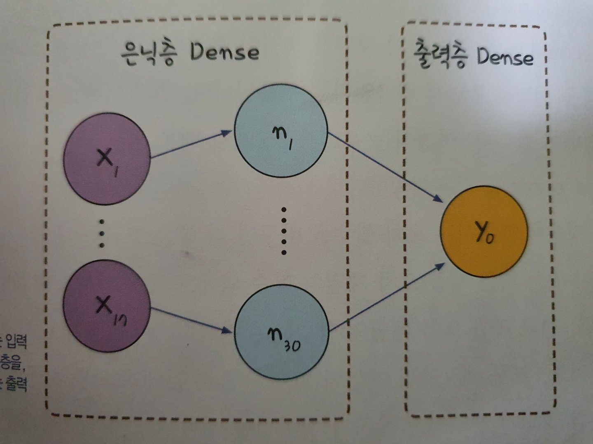

# 모델 설계
지금까지 배운 신경망 구축 과정을 바탕으로 앞서 간략히 소개한 폐암환자 분류에 대한 신경망을 깊게 해석해보고자 한다. 

## 사용 데이터
분류|정보1|정보2|정보3|...|정보17|생존 여부
|:---:|:---:|:---:|:---:|:---:|:---:|:---:
|1번환자|293|1|3.8|...|62|0
|2번환자|1|2|2.88|...|60|0
|3번환자|8|3|3.19|...|66|1
|...|...|...|...|...|...|...
|470번환자|447|8|5.2|...|49|0

---
## 1. 전체 코드
<pre>
    <code>    

from tensorflow.keras.models import Sequential
from tensorflow.keras.layers import Dense

import numpy as np
import tensorflow as tf
import os

np.random.seed(3)
tf.random.set_seed(3)

scriptpath_noname = os.path.realpath( os.path.dirname(__file__) )

Data_set = np.loadtxt(scriptpath_noname+'/'+'ThoraricSurgery.csv', delimiter=",")

X = Data_set[:,0:17]
Y = Data_set[:,17]

model = Sequential()
model.add(Dense(30, input_dim=17, activation='relu'))
model.add(Dense(1, activation='sigmoid'))

model.compile(loss='binary_crossentropy', optimizer='adam', metrics=['accuracy'])
model.fit(X, Y, epochs=100, batch_size=10)

    </code>
</pre>

 
---

## 2. 라이브러리

<pre>
    <code>
    from tensorflow.keras.models import Sequential
    from tensorflow.keras.layers import Dense
    </code>
</pre>
 
#### (1) keras.models.sequential
- 신경망의 정의에 해당하는 함수이다.
- **sequential모델**은 각 레이어에 **정확히 하나의 입력 텐서와 하나의 출력 텐서**가 있는 일반 레이어 스택에 적합한 모델이다.
- 선언의 경우엔 **sequential()** 호출을 기반으로 
  - add() 메서드를 통한 신경망 내 레이어 추가
  - 생성자에 레이어 목록을 전달한 신경망 생성

 

- add()메서드를 통한 모델생성 예시
<pre>
    <code>
model = sequential() #모델 선언

model.add(layers.Dense(2, activation = "relu", name = "layer1"))
model.add(layers.Dense(3, activation = "relu", name = "layer2"))
model.add(layers.Dense(4, activation = "relu", name = "layer3"))
    </code>
</pre>

 - 생성자 전달을 통한 모델 생성 예시
<pre>
    <code>
#모델 선언과 동시에 초기화
model = keras.Sequential( 
  [
      layers.Dense(2, activation="relu"),
      layers.Dense(3, activation="relu"),
      layers.Dense(4),
  ])
  </code>
</pre>

해당 선언을 통해 선언된 레이어는 **layers** 속성 통해 접근이 가능하며, pop()메서드를 통한 제거작업또한 가능하다. 
이는 list와 매우 유사한 모습이다.

<pre>
<code>
model.layers
model.pop()
print(len(model.layers))  # 2
</code>
</pre>

#### (2) keras.layers.Dense
- keras.layers.Dense는 레이어 내부의 구성을 위한 라이브러리로, 다음과 같은 인자를 바탕으로 구성을 수행합니다.
  - units
    - 해당 층의 출력 개수, 양의정수로 정의
  - activation
    - 층 내에 필요한 활성화 함수 정의(ex) relu, sigmoid, ...)
  - use_bias
    -  해당 층에서 바이어스 행렬을 사용하는지에 대한 여부
  - bias_initializer
    - use_bias를 사용시 바이어스 행렬의 초기값 설정
  - kernel_regularizer
    - 가중치 행렬에 적용되는 정규화 함수
  - bias_regularizer
    - 바이어스 행렬에 적용되는 정규화 함수
  - kernel_constraint
    - 가중치 행렬에 적용되는 제약함수(가중치의 최대값 정의)
  - bias_constraint
    - 편향 행렬에 적용되는 제약함수(바이어스의 최대값 제약, 음수값 제약 등등)

- Dense 메서드를 통한 선언 예시
<pre>
<code>    
model = seqeuntial()    #모델 선언

# 한 층에 30개의 노드를 만들것이며 17개의 값을 입력받는다, 활성화 함수는 Relu함수.
model.add(Dense(30, input_dim = 17, activation = 'relu'))   
</code>
</pre>

이렇게 선언된 층중에 가장 마지막에 선언된 층이 출력층의 기능을 한다.

 
----
## 3. 입력층, 은닉층, 출력층
<pre>
    <code>
    model = sequential()
    model.add(Dense(30, input_dim = 17, activation = 'relu'))
    model.add(Dense(1, activation = 'sigmoid'))
    </code>
</pre>

인공 신경망이란 퍼셉트론위에 은닉층을 하나씩 쌓아가는 형태로 정의됨을 학습했기에 해당 형태를
sequential 함수를 통해 보다 쉽게 정의할 수 있다.

앞서 배운 라이브러리부분에 바탕으로 해당 코드는 다음과 같이 설명할 수 있다.
- model = sequential을 통한 신경망 프레임 구성
- 17개의 입력값을 가지며 이를 30개의 노드로 보내고, relu함수를 활성화 함수로 사용하는 은닉층을 생성
- 은닉층에서 입력받은 값을 sigmoid함수를 거쳐 1개의 노드를 갖는 출력층 생성

코드를 실행하게 되면 다음과 위 그림과 같은 형태의 모델이 생성이 된다.

---

## 4. 모델 컴파일
<pre>
  <code>
model.compile(loss = 'mean_squared_error', optimizer='adam', metrics = ['accuracy])
  </code>
</pre>

- 해당 부분은 생성한 모델의 학습 과정에 관여하는 부분으로 **오차함수**, **최적화**, **수행결과**에 관한 인자값을 갖는다.
  - 오차함수(loss)은 평균제곱 오차를 택하여 오차를 계산합니다.
    $$ MSE = \frac{1}{470}(y_{t1} - y_{o1})^{2}  $$
  - 최적화(optimizer)는 adam 함수를 통한 최적화를 선택, 이는 가중치 업데이트 시, 관성(v)와 학습률 감소(h)가 추가된 형태로 업데이트 된다. 
  $$ w_{t+1} = w_{t} - \frac{η}{\sqrt{h_{t}+ε}}v_{t}  $$

  - metrics는 훈련 및 테스트 과정에서 평가되는 매트릭스의 리스트 항목으로, accuracy 인자는 테스트 레이블과 실제 레이블간의 정확도를 평가하는 인자이다.

### 5. 모델 실행
<pre>
<code>
model.fit(X, Y, epochs=100, batch_size=10)
print ("\n Accuracy: %.4f" %(model.evaluate(X,Y)[1]))
</code>
</pre>

분류|정보1|정보2|정보3|...|정보17|생존 여부
|:---:|:---:|:---:|:---:|:---:|:---:|:---:
|1번환자|293|1|3.8|...|62|0
|2번환자|1|2|2.88|...|60|0
|3번환자|8|3|3.19|...|66|1
|...|...|...|...|...|...|...
|470번환자|447|8|5.2|...|49|0

- 총 470개의 샘플을 17개의 정보를 속성값으로, 마지막 18번째 값을 클래스로 구분지어 데이터를 구성했다.
- 첫번째 인자인 X는 훈련데이터로 모든 샘플의 17개의 데이터를 바탕으로 구성
- 두번째 인자 Y는 수술결과를 레이블 데이터로 사용한다.
- epochs는 모든 샘플에 대한 학습을 1회로 하여 총 반복횟수를 의미한다.
- batch_size는 학습시 몇개의 샘플을 끊어서 처리 할 것인가에 대한 것을 의미한다.
  
  - 해당 인자의 값이 클 경우, 학습속도가 느려지며 값이 적을 경우, 실행값의 편차가 생겨 결과값이 일정하지 않을 수 있다.
  
  > 결과값은 Accuracy: 0.8553으로 나타난다.