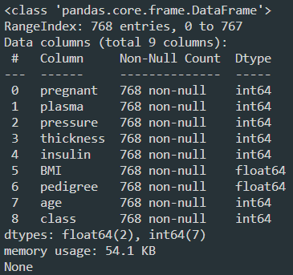
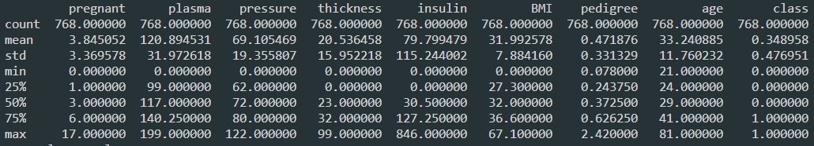
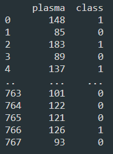
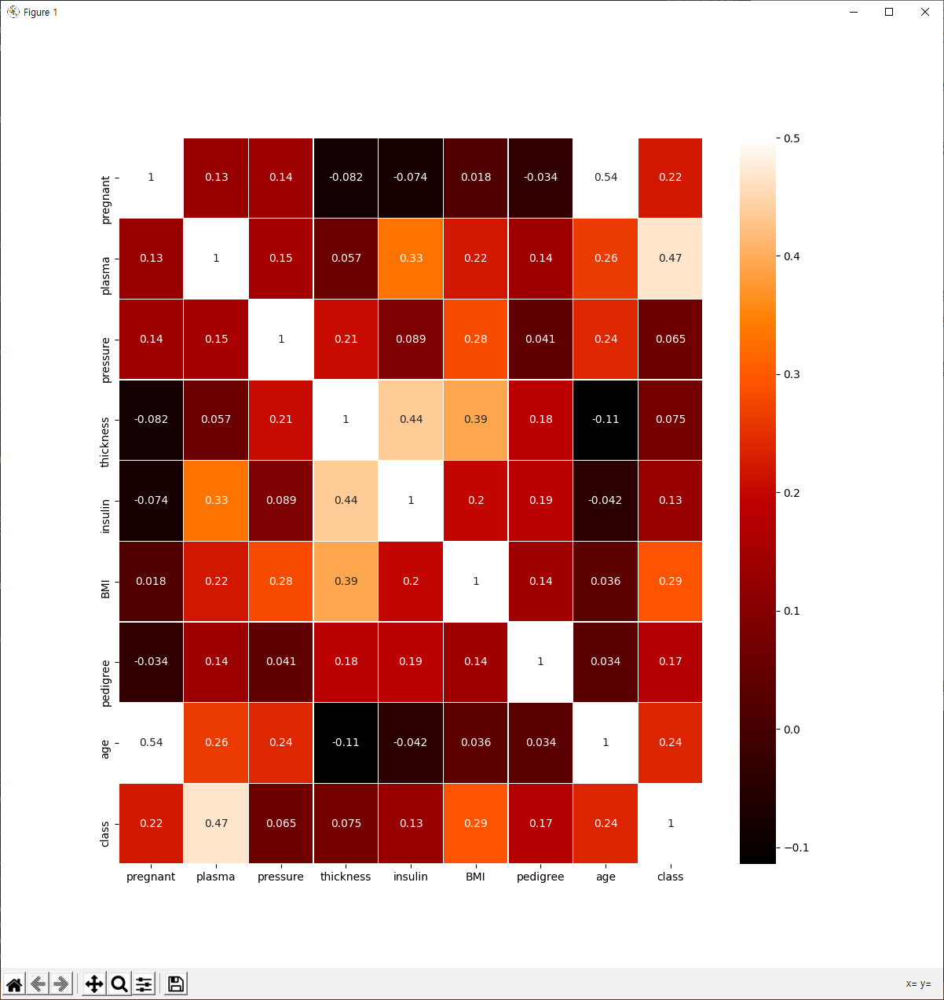
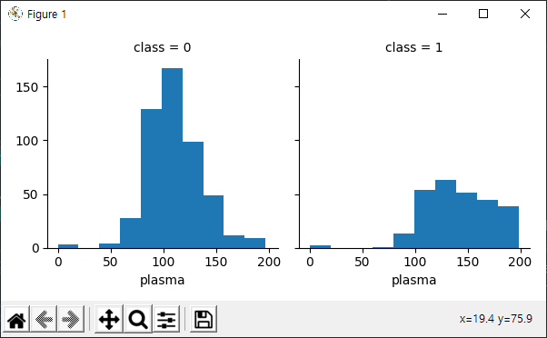

# 11장. 데이터 다루기

해당 장에서는 피마인디언의 당뇨 및 비만 관련 데이터를 통해 **데이터 가공**에 대해 알아본다.

||정보1|정보2|정보3|...|정보8|당뇨병 여부
|:---:|:---:|:---:|:---:|:---:|:---:|:---:
|1번환자|6|148|72|...|50|1
|2번환자|1|85|66|...|31|0
|3번환자|8|183|64|...|32|1
|...|...|...|...|...|...|...
|768번환자|1|93|70|...|23|0

총768개의 샘플로 각 샘플마다 7개의 속성, 1개의 클래스로 구분지어 훈련을 수행한다.

----

## 피마 인디언 데이터를 통한 예측
### 전체 코드
<pre>
<code>
from keras.models import Sequential
from keras.layers import Dense
import numpy
import tensorflow as tf

# seed 값 생성
numpy.random.seed(3)
tf.random.set_seed(3)

import os

#오류 발생을 위해 경로를 설정
scriptpath_noname = os.path.realpath( os.path.dirname(__file__) )
dataset = numpy.loadtxt(scriptpath_noname+'/'+'pima-indians-diabetes.csv', delimiter=",")

X = dataset[:,0:8]
Y = dataset[:,8]

model = Sequential()
model.add(Dense(12, input_dim=8, activation='relu'))
model.add(Dense(8, activation='relu'))
model.add(Dense(1, activation='sigmoid'))

model.compile(loss='binary_crossentropy',
             optimizer='adam',
             metrics=['accuracy'])

model.fit(X, Y, epochs=200, batch_size=10)

print("\n Accuracy: %.4f" % (model.evaluate(X, Y)[1]))
</code>
</pre>
----

### pandas를 활용한 데이터 조사

<pre>
    <code>
import pandas as pd
scriptpath_noname = os.path.realpath( os.path.dirname(__file__) )

#피마 인디언 당뇨병 데이터셋을 불러옵니다. 불러올 때 각 컬럼에 해당하는 이름을 지정합니다.
df = pd.read_csv(scriptpath_noname+'/'+'pima-indians-diabetes.csv',
               names = ["pregnant", "plasma", "pressure", "thickness", "insulin", "BMI", "pedigree", "age", "class"])
    </code>
</pre>
read_csv()를 통해 csv데이터를 가져와 names함수를 통해 속성별 키워드를 지정

- 정보 1(pregnant): 과거 임신 횟수
- 정보 2(plasma): 포도당 검사 2시간 후의 공복 혈당 농도
- 정보 3(pressure): 확장기 혈압
- 정보 4(thickness): 삼두근 피부 주름 두깨
- 정보 5(insulin): 혈청 인슐린
- 정보 6(BMI): 체질량 지수
- 정보 7(pedigree): 당뇨병 가족력
- 정보 8(age): 나이
- 클래스: 당뇨 확진여부(0 or 1)

----
<pre>
    <code>
print(df.head(5))
    </code>
</pre>
해당 코드를 작성 시 df에 저장된 데이터의 상태를 조회할 수 있다.
정보마다 데이터가 올바르게 지정되어있는 모습이 확인 가능하다.
|   |pregnant|plasma|pressure|...|pedigree|age
|:---:|:---:|:---:|:---:|:---:|:---:|:---:
|0|6|148|72|...|50|1
|1|1|85|66|...|31|0
|2|8|183|64|...|32|1
|3|1|89|66|...|21|0
|4|0|137|40|...|23|1

---
<pre>
    <code>
print(df.info())
print(df.describe())
print(df[['plasma', 'class']])
    </code>
</pre>
전체적인 데이터의 형태를 직접적으로 확인할 수 있으며 다음과 같은 결과가 나온다.
> df.info()

> df.describe()

- 정보별 샘플 수, 평균, 표준편차, 최솟값, 백분위 수로 일정 퍼센트에 해당하는 값 및 최대값이 정의되어 있다.
 
> df \[ ['pregnant', 'class']]

  
- 일부 칼럼을 확일 할 때, 특히 위의 예시는 pregnant, class 즉 임신횟수와 당뇨병 발병 여부만을 확인하는 코드이다.
----
### 데이터 가공
단순한 데이터의 나열은 가독성이 떨어지므로 큰 의미가 없다. 따라서 클래스의 결과와 관계가 깊은 인자를 통해 다시금 데이터를 정렬한다.

본 예제에서는 임신 횟수와 당뇨병의 발병 확률로 다시 정리한다.
<pre>
<code>
print(df[['pregnant','class']].groupby(['pregnant'], as_index=False).mean().sort_values(by = 'pregnant', ascending = True))
</code>
</pre>

- 해당 코드는 다음과 같이 3가지 함수로 구분 지을 수 있다.
  - groupby() 함수를 사용해 임신 정보를 기준으로하는 새 그룹을 생성한다. as_index는 이렇게 생성된 pregnant레이블 옆에 새로운 인덱스를 추가한다.
  - mean함수를 사용해 해당 값에 대한 평균을 구한다.
  - sort_values() 함수를 사용해 해당 정보들을 오름차순으로 정리한다.
  - 해당 값으로 정렬된 당뇨병 발발 확률이 구해진다.

|   |pregnant|class|
|:---:|:---:|:---:|
|0|0|0.342342|
|1|1|0.214815
|2|2|0.184466
|...|...|...|
|13|13|0.5
|14|14|1
|15|15|1
|16|16|1

---

### 그래프로의 표현

앞서 가공한 데이터 테이블을 그래프로 표현하여 가독성을 높인다. 이 부분에서는 파이썬에서 제공하는 라이브러리를 통해 그래프의 표현에 대해 알아본다.

<pre>
<code>
import matplotlib.pyplot as plt
import seaborn as sns
</code>
</pre>

- matplotlib은 파이썬에서 그래프를 그릴 때 가장 많이 사용되는 라이브러리로 여기에 정교함을 더해주는 seaborn라이브러리를 추가로 사용하여 정보간의 상관관계를 파악한다.
  
<pre>
<code>
plt.figure(figsize=(12,12))
</code>
</pre>
- 그래프의 크기를 지정한다.
  
<pre>
<code>
sns.heatmap(df.corr(),linewidths=0.1,vmax=0.5, cmap=colormap, linecolor='white', annot=True)
plt.show()
</code>
</pre>
- df.corr
  - 해당 메서드는 두 변수에 대한 상관관계를 파악하는 함수이며 이는 피어슨 상관계수로 분석이 된다.
    - 두 변수간의 관련성을 구하기 위해 보편적으로 사용되는 함수
    - r = x와 y가 함께 변하는 정도/ x와 y가 각각 변하는 정도
  - 1에 가까울 수록 양의 상관관계이며 -1에 가까울수록 음의 상관관계이다.
  - |r 값|관계|
    |:---:|:---:|:---:|
    |+0.7 ~ +1.0|강한 양적 상관관계|
    |+0.3 ~ +0.7|뚜렷한 양적 상관관계|
    |+0.1 ~ -0.1|약한 양적 상관관계|
    |-0.3 ~ -0.1|약한 음적 상관관계|
    |-0.7 ~ -0.3|뚜렷한 음적 상관관계|
    |-1.0 ~ +0.7|강한 음적 상관관계|
    
- linewidths
  - cell사이의 선 길이를 나타내는 인자
- vmax
  - 셀당 색의 최대 밝기를 나타내는 인자
- cmap
  - 히트맵의 색설정 인자
- linecolor
  - 셀을 나누는 선의 색상을 나타냄
- annot = True
  - 각 셀마다 값을 표시할 것인지에 대한 여부 
- plt.show()
  - 코드 그래프를 나타낸다

  ---
- 그래프를 자세히 보면 당뇨병 발병에 가장 큰 영향을 미치는 값이 어떤 것인지 상관관계에 나타나있다.
따라서 plasma 값이 가장 결론과 가장 밀접한 관련이 있다는 것을 확인할 수 있다.
<pre>
<code>
grid = sns.FacetGrid(df, col = 'class')
grid.map(plt.hist, 'plasma', bins=10)
plt.show()
</code>
</pre>

- 이는 패싯그리드를 통한 그래프 생성이다. col인자로 class를 삽입하여 class가 0일경우와 1일 경우에 따른 2열 형태의 그래프 비교가 가능하다
- map메서드 내에서는 hit인자를 통해 막대형 기록이 나타나게 되었으며, 해당 그래프 내의 plasma분포를 bins만큼 정의된 구간 내에 분포치를 확인할 수 있다.

------