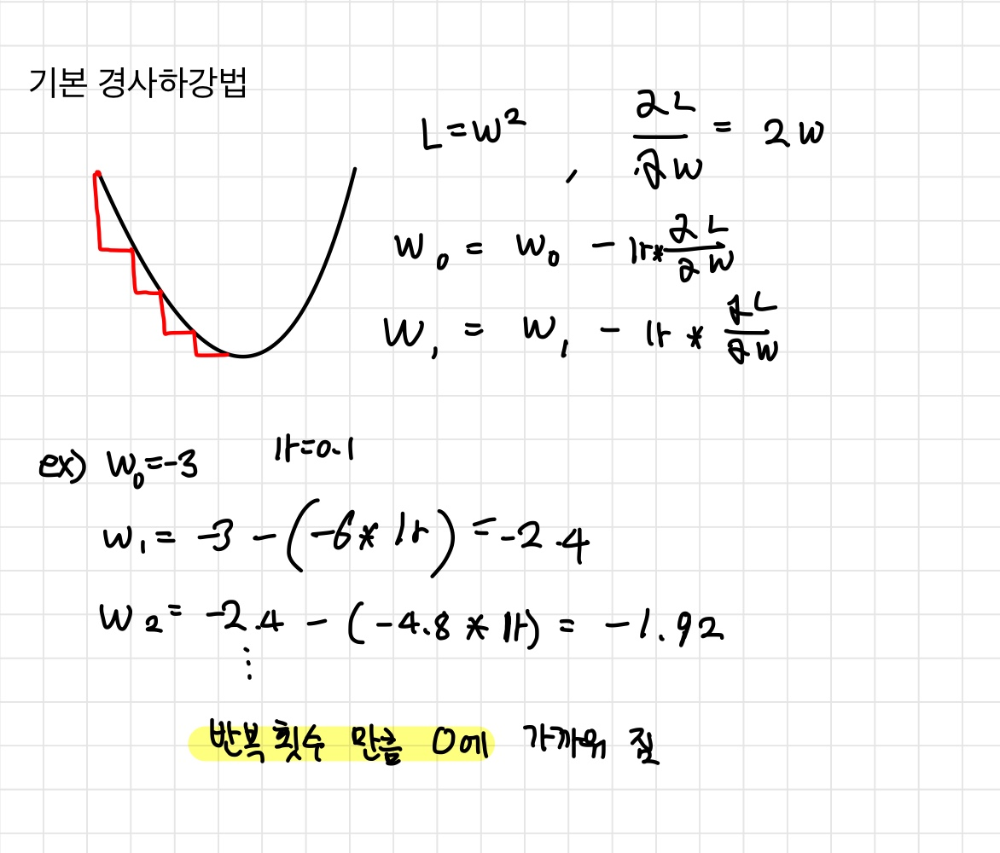
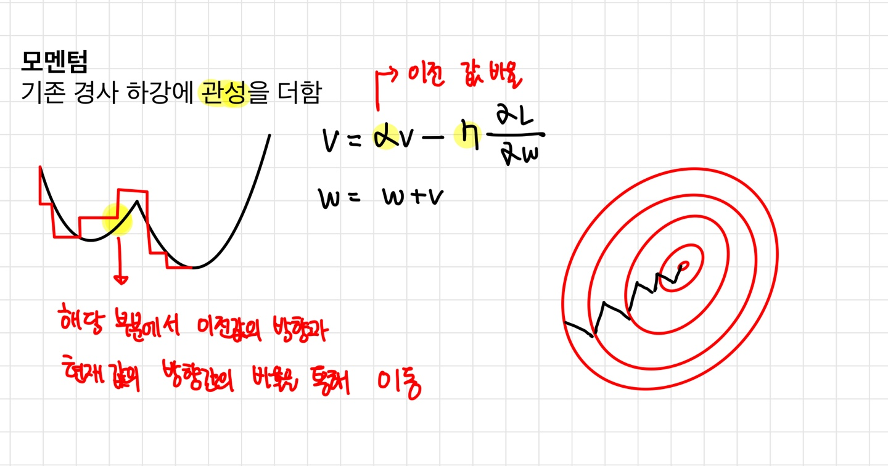
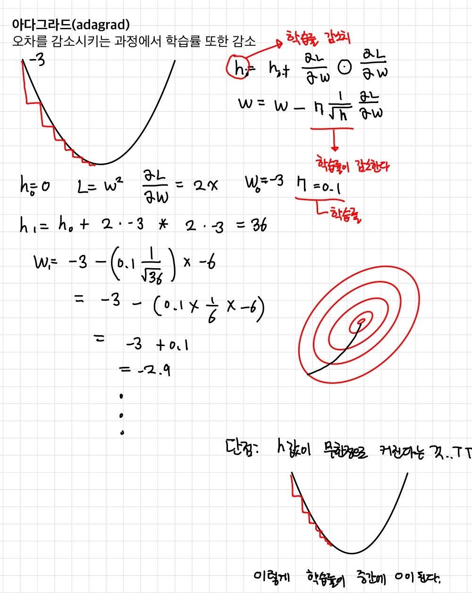
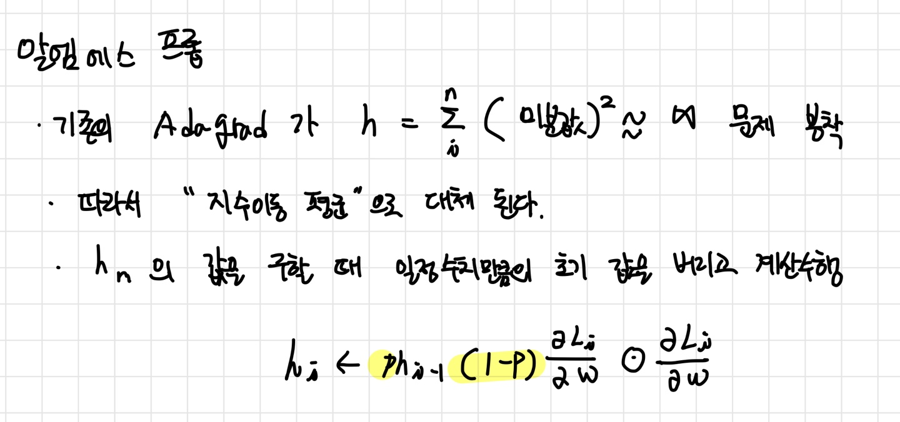
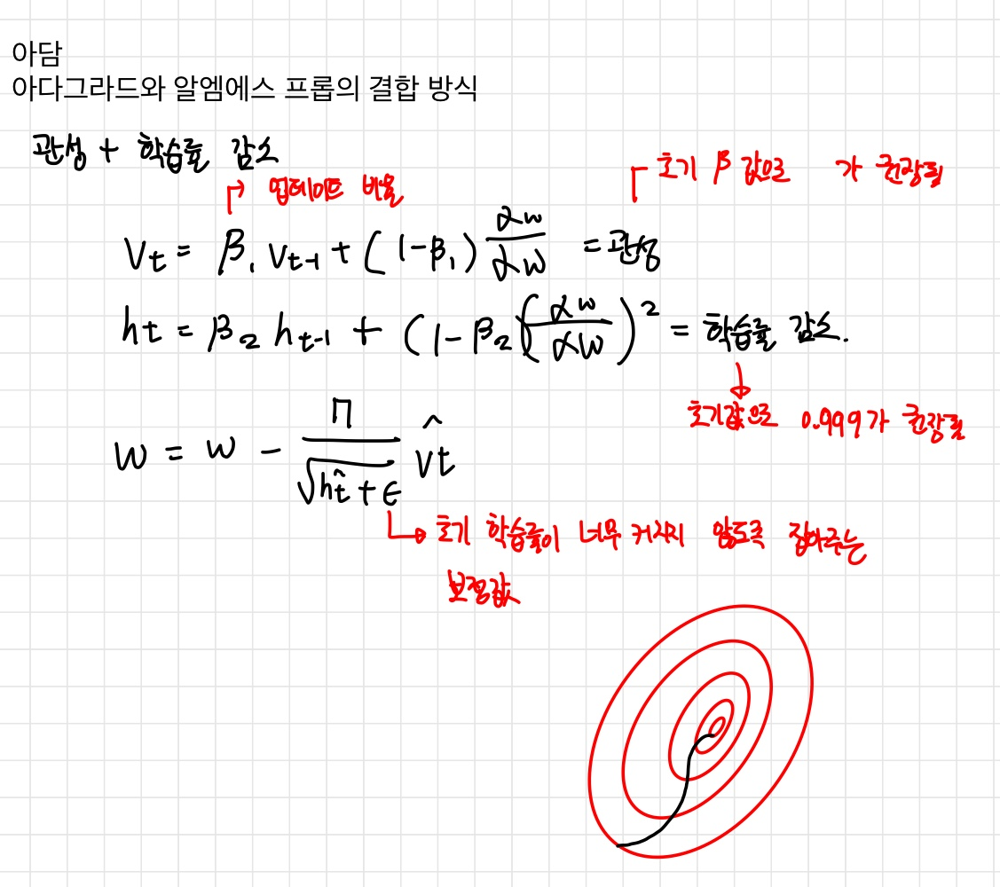

# 고급 경사하강법
---
### 1. 확률적 경사하강법

$$ w_{t+1} = w_{t} - lr\frac{dl}{dw}$$

- 일반적인 경사 하강법과 수식상에서는 차이가 없으며 이전에 학습했던 내용과 같다
 
- 오차함수의 미분값에 학습률을 곱하여 이전 가중치에서 차한 값이다.
- 이 외에도 Batch 경사하강법 , mini_batch 경사하강법이 존재하며, 
 
- Batuch 경사하강법은 모든 데이터를 한꺼번에 학습하는데 활용하므로 시간이 다소 소요된다.

- mini-batch 경사하강법은 전체 학습 데이터를 배치사이즈로 나누어 순차적으로 오차를 계산한다. 일반적으로 많이 사용되는 방법으로 batch보다 빠르며 확률적 경사하강법보다 오차율이 낮다.
- 뿐만아니라 이상적인 모델에 있어서 경사하강 최적화는 가장 높은 성능을 나타낸다.

---
### 2. Momentum(모멘텀)

> 모멘텀은 기존 경사하강법에 **관성**이라는 개념을 추가한 것으로 생각하면 된다.
> 상수로 전해지는 업데이트 비율을 이전 관성에 곱한 값에다 학습률과 오차의 미분값에대한 곱을 차하면 다음 관성이 구성이 되며**
$$ v_{t+1} = αv_{t} - lr\frac{dl}{dw} $$  
> 이를 현재 가중치값에서  빼면 다음 가중치가 업데이트 된다.
> $$ w_{t+1} = w_{t} - v$$
> 해당 최적화 함수는 가장 이상적인 모델이 아닌 불규칙한 형태의 그래프에서 이전 값의 방향에서 업데이트 여부를 확인받아, 일반 경사하강에서 지나갈 수 없는 굴곡을 넘어서는 기능을 갖는다.
> 

---
### 3. adagrad(아다그라드)

* 아다그라드 최적화함수는 개념상 학습률을 점점 감소시켜가며 오차를 조절해나간다.
  $$ h_{t+1} = h_{t} + (\frac{dl}{dw})^2 $$ 
* 이를 위해 학습률 감소치인 h라는 변수가 추가적으로 주어지며 h는 1/미분값을 기존 오차에 곱하여 기존 가중치에서 차감하는 방식이다.
 $$ w_{t+1} = w_{t} - lr\frac{1}{\sqrt{h_{t}}}\frac{dl}{dw}  $$  
* 초기 학습률을 크게 잡을수록 꽤 먼거리까지 오차를 탐색할 수 있으나, 초기학습률을 적게 잡았을 경우 학습률이 최적화 과정에서 0에 가까워지지 못한채 0에 0에 가까워지는 치명적인 단점이 있다.
---
### 4. RMSProp(알엠에스프롭)

$$ h_{t+1} = h_{t} + (\frac{dl}{dw})^2 $$ 
- 기존 아다그라드 함수의 학습률이 0에 다다르는 문제를 해결하기 위해 고안되었다.
$$ h_{t+1} = ph_{t}(1-p)(\frac{dl_{t}}{dw_{t}})^2 $$
- 기존 아다그라드가 **지수이동 합**의 개념으로 값이 무한대로 나갔다면 알엠에스프롭은 지수이동 평균이라는방식으로, 업데이트 비율을 추가하여 계산되어 가는 학습률이 0이 되지 않도록 보정해준다.(해당 수식에서 p가 그 역할을 한다.)

---
### 5. Adam(아담)

- 이는 아다그라드와 알엠에스 프롭의 방식이 합쳐져서 생긴 최적화 방식으로 현재 학습에 있어서 가장 많이 쓰이는 최적화이다.
- 앞서 모멘텀에서 나온 관성과 아다그라드에서 나온 학습률 감소 개념이 존재한다.
- 관성값은 기존 관성을 구하는 식에 업데이트 비율을 부가하여 구한다.
$$ v_{t+1} = β_{1}vt_{t} + (1-β_{1})\frac{dl}{dw}$$ 
- 학습률 감소치의 경우 마찬가지로 업데이트 비율을 추가하여 구한다.
$$ h_{t+1} = β_{1}h_{t} + (1-β_{1})(\frac{dl}{dw})^2 $$ 
- 최종적으로 가중치를 곱하는데 여기서 학습률이 0에 이르지 않도록 보정해주는 입실론개념을 더하여 가중치에 차한다. 
$$ w_{t+1} = w - \frac{lr}{\sqrt{h_{t} + ε}}vt $$
- 기본적으로 각각의 베타에 권장되는 값이 존재하는데 이는 각각 β1 =  0.9와 β2 = 0.999이다.
- 연산이 수행 될 경우 다양한 굴곡에서 벗어나기 쉬우며 속도 또한 최종 오차에 맞게 올바르게 조절이 되는 함수이다.